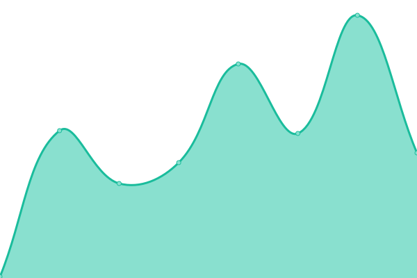
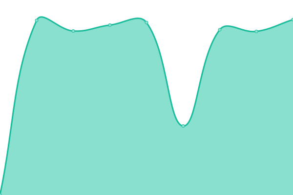
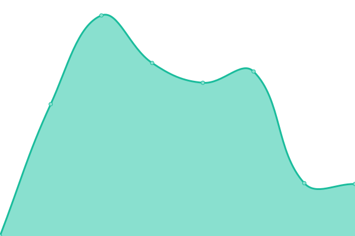

# [📈 Live Status](https://dennykorsukewitz.github.io/upptime): <!--live status--> **🟩 All systems operational**

This repository contains the open-source uptime monitor and status page for [Denny Korsukéwitz](https://github.com/dennykorsukewitz), powered by [Upptime](https://github.com/upptime/upptime).

With [Upptime](https://upptime.js.org), you can get your own unlimited and free uptime monitor and status page, powered entirely by a GitHub repository. We use [Issues](https://github.com/dennykorsukewitz/upptime/issues) as incident reports, [Actions](https://github.com/dennykorsukewitz/upptime/actions) as uptime monitors, and [Pages](https://dennykorsukewitz.github.io/upptime) for the status page.

<!--start: status pages-->
<!-- This summary is generated by Upptime (https://github.com/upptime/upptime) -->
<!-- Do not edit this manually, your changes will be overwritten -->
<!-- prettier-ignore -->
| URL | Status | History | Response Time | Uptime |
| --- | ------ | ------- | ------------- | ------ |
|  [dennykorsukewitz.github.io](https://dennykorsukewitz.github.io/) | 🟩 Up | [dennykorsukewitz-github-io.yml](https://github.com/dennykorsukewitz/upptime/commits/HEAD/history/dennykorsukewitz-github-io.yml) | 

 113ms
     
 | 

<a href="https://dennykorsukewitz.github.io/upptime/history/dennykorsukewitz-github-io">100.00%</a>
    

|  [hausdienst-nita.de](http://hausdienst-nita.de/) | 🟩 Up | [hausdienst-nita-de.yml](https://github.com/dennykorsukewitz/upptime/commits/HEAD/history/hausdienst-nita-de.yml) | 

 565ms
     
 | 

<a href="https://dennykorsukewitz.github.io/upptime/history/hausdienst-nita-de">100.00%</a>
    

|  [preussundreschke.de](http://www.preussundreschke.de/) | 🟩 Up | [preussundreschke-de.yml](https://github.com/dennykorsukewitz/upptime/commits/HEAD/history/preussundreschke-de.yml) | 

 3171ms
     
 | 

<a href="https://dennykorsukewitz.github.io/upptime/history/preussundreschke-de">100.00%</a>
    

|  [metallbau-bresch.de](http://www.metallbau-bresch.de/) | 🟩 Up | [metallbau-bresch-de.yml](https://github.com/dennykorsukewitz/upptime/commits/HEAD/history/metallbau-bresch-de.yml) | 

 2242ms
     
 | 

<a href="https://dennykorsukewitz.github.io/upptime/history/metallbau-bresch-de">100.00%</a>
    

|  [jsfeuerwerk.de](http://www.jsfeuerwerk.de/) | 🟩 Up | [jsfeuerwerk-de.yml](https://github.com/dennykorsukewitz/upptime/commits/HEAD/history/jsfeuerwerk-de.yml) | 

 2435ms
     
 | 

<a href="https://dennykorsukewitz.github.io/upptime/history/jsfeuerwerk-de">100.00%</a>
    

<!--end: status pages-->

[**Visit our status website →**](https://dennykorsukewitz.github.io/upptime)

## 📄 License

- Powered by: [Upptime](https://github.com/upptime/upptime)
- Code: [MIT](./LICENSE) © [Anand Chowdhary](https://anandchowdhary.com), supported by [Pabio](https://pabio.com)
- Data in the `./history` directory: [Open Database License](https://opendatacommons.org/licenses/odbl/1-0/)
